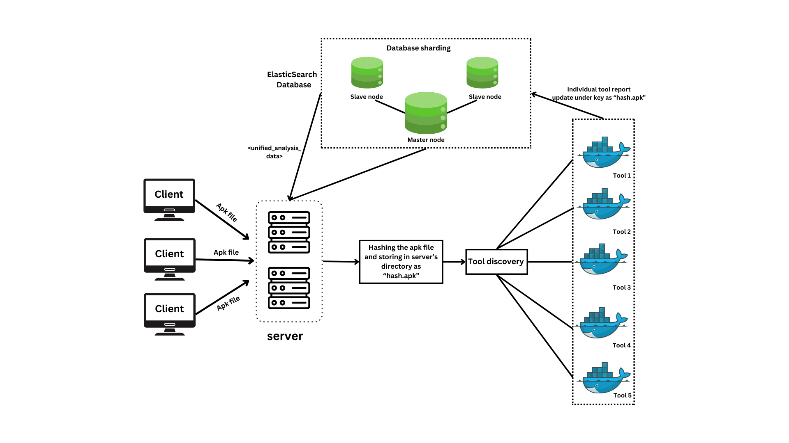
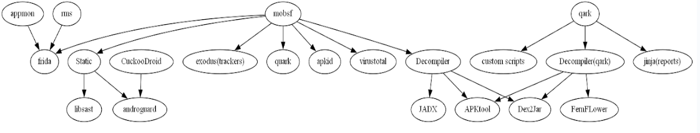
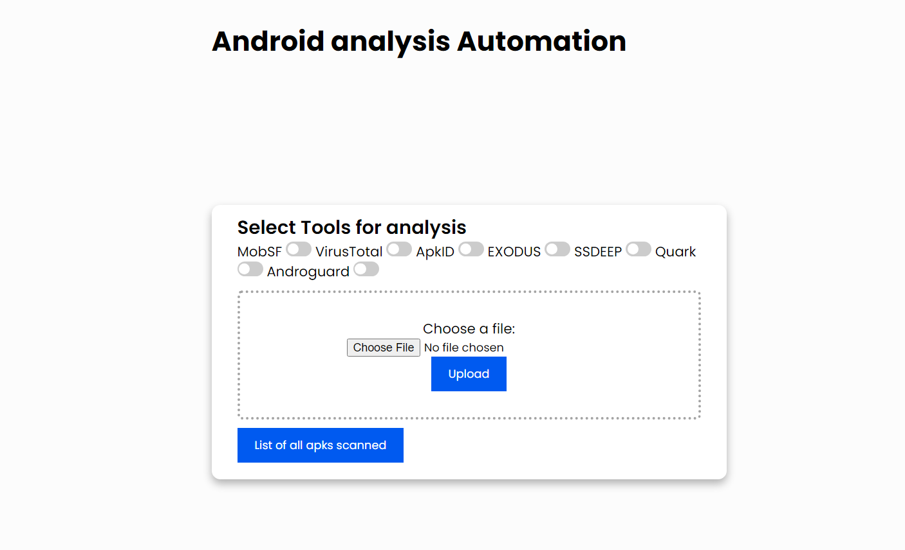
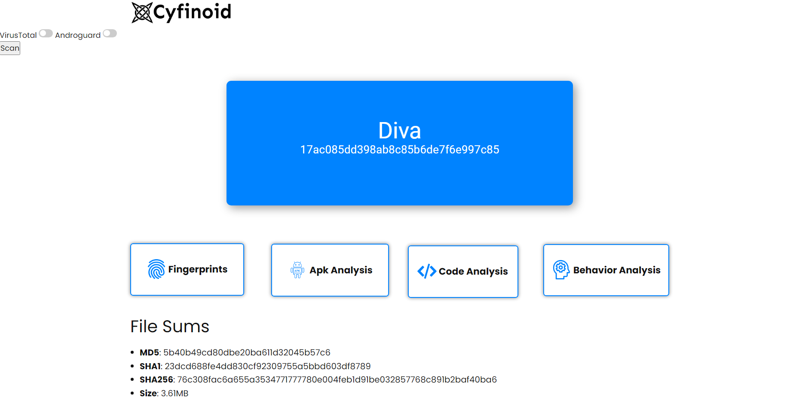
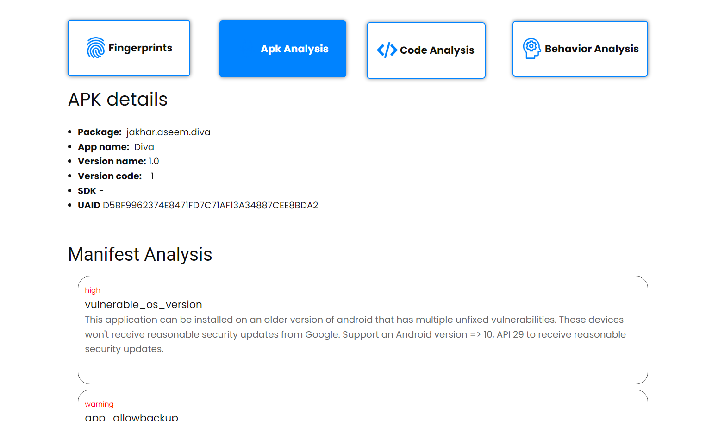
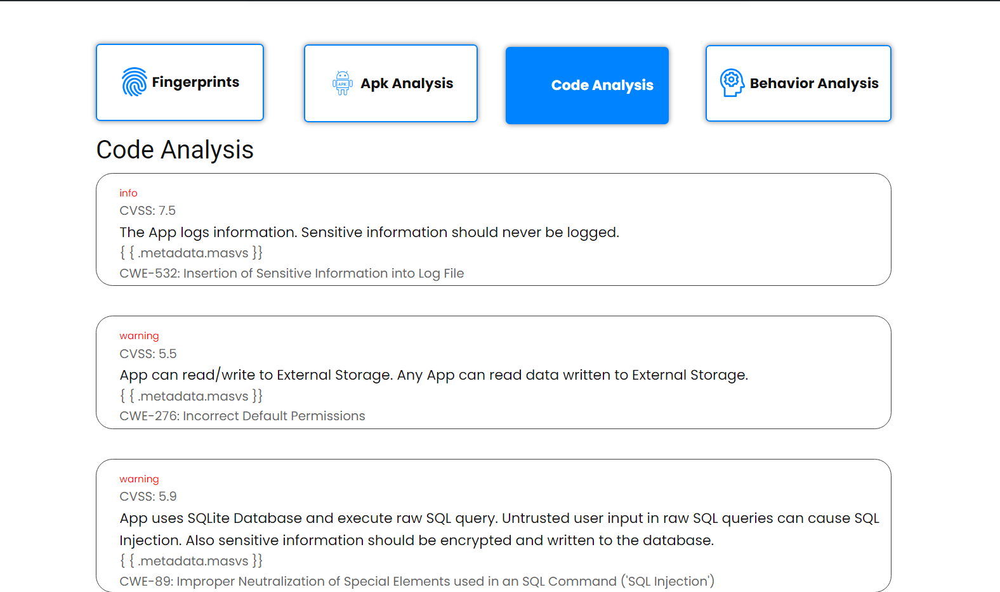
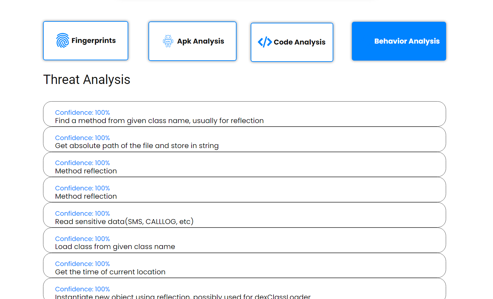

# apk-analysis-automation

A project to streamline and automate multiple apk analysis tooling and aggregate result.
This tool unlocks faster identification of vulnerabilities, trackers, malware and threats this tool champions proactive threat mitigation and contributes to a more secure Android ecosystem.

Open source tools used in this project (You can use specific tools by your choice through query parameters, by default server will run all the tools asynchronously): 

- ApkID
- SSDeep
- Virustotal
- Mobsf
- Quark
- Androguard
- Exodus

### High level System Design


### How different publicly available tools depend on each other:


## Requirements
- [Install Docker](https://docs.docker.com/engine/install/)
- Linux or WSL environment
- [VirusTotal's API KEY](https://www.virustotal.com/gui/my-apikey)

## Setup Instructions (Only for Linux or WSL)

Follow the steps below to set up the project after cloning this repository:

1. Run the base setup to download all the images:
   ```
   sh base_setup.sh
   ```

2. Make and edit an environment file "rest.env"
   ```
   echo "VT_KEY=<-- your virustotal api key-->" >> rest.env
   echo "ELASTIC_VERSION=<--elasticSearch version, 8.13.1-->" >> rest.env
   echo "ELASTIC_PASSWORD=<-- your custom elasticSearch password-->" >> rest.env
   ```

3. To create the modified image of mobsf that has been used in this project,
   ```
   git clone https://github.com/MobSF/Mobile-Security-Framework-MobSF.git
   cd Mobile-Security-Framework-MobSF/
   ```
   Open Mobile-Security-Framework-MobSF/mobsf/Mobsf/settings.py file, in settings.py at line 327 and 338, change the lines to: // mention default behaviour  
   ```
   NIAP_ENABLED = bool(os.getenv('MOBSF_NIAP_ENABLED', ''))
   APKID_ENABLED = bool(os.getenv('MOBSF_APKID_ENABLED', ''))
   ```
   This is done to disable the time taking processes, NIAP analysis and APKiD analysis. You can skip this step and directly build the image. Now build the image:
   ```
   docker build -t mobsf .
   ```


## Running the Project
1. Run ElasticSearch using docker-compose (in a different terminal)
   ```
   docker-compose --env-file rest.env up
   ```
2. Run Mobsf Docker container (in a different terminal)
   ```
   docker run -it --rm -p 8000:8000 --net elastic --name mobsf opensecurity/mobile-security-framework-mobsf:latest
   ```
3. REST architecture has been followed. After running the server, go to http://localhost:8080/ and upload an apk file for analysis.
   Once you have completed the setup steps, you can run the server by executing the following command:
   ```
   go run rest.go
   ```

## Screenshots
- Upload an APK file

- Analysis pages





## Parallelism
For efficient parallelism and scheduling of surplus amount of requests, such as passing huge number of apks at a time, firstly run the server and open pipeline.go:
maxProcessingCount number represents the number of apk files that can be processed parallely. It should be proportional to the number of CPU cores you can provide.
Each apk file is passed serially to every tool.
```
const (
	maxProcessingCount = 8 //Customizable or ideally number of CPU Cores
)
```
Either rename all the apk files base name into their "hash.apk" form and paste it in ./uploads folder from your end or uncomment the below code and pass the directory with the list of apk files in the function.
```
//INPUT SOURCE DIRECTORY IN THE BELOW FUNCTION ARGUMENT
// err := renameAndCopyApkFiles("--input--", "./uploads")
// if err != nil {
// 	panic(err)
// }
```
Now run the redis server for efficient management of queue with all the apk hashes:
```
redis-server
```
```
go run pipeline.go
```
## Future Scope
- [ ] Frontend has to be revamped.
- [ ] Conduct in-depth profiling to measure goroutine scheduling and context switching costs. Tools like the Go execution tracer can be used for this analysis.
- [ ] Integrating tools like **Semgrep**

### Contributors

- Vansh Bulani (Internship project at Cyfinoid Research)  
  [Checkout my portfolio](https://www.vanshbulani.info)  
  [Checkout my blog about this project](https://www.vanshbulani.info/blogs)  
  [LinkedIn](https://www.linkedin.com/in/vanshbulani/)  


